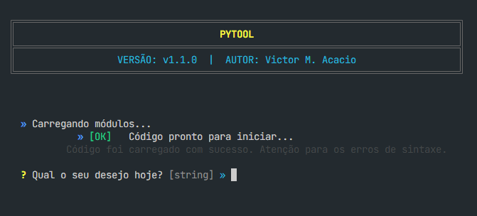

# **PYTOOL** _- Ferramentas para Estilo e Padronização_


Este repositório contém um conjunto de ferramentas separadas em módulos de acordo com seu objetivo. O pacote foi desenvolvido em Python e tem objetivo de focar na padronização de visualizações científicas e na organização de informações de terminal. O projeto oferece um conjunto de utilitários que simplificam a geração de gráficos com qualidade de publicação, importação e exportação de arquivos em arquivos de texto e a estruturação de saídas no console, otimizando o monitoramento e a apresentação de informações.

## Autoria

**Victor Moreira Acacio**

Instituto de Astronomia, Geofísica e Ciências Atmosféricas da Universidade de São Paulo (IAG-USP)

GitHub: [@OAkacio](https://github.com/OAkacio)

ORCID: [0009-0007-4484-2129](https://orcid.org/0009-0007-4484-2129)

## Instalação

Adicione esta pasta em forma de submódulo no seu repositório para conseguir chama-lá de qualquer arquivo. Você pode adicionar na rai do seu repositório pelo terminal com:

```bash
git submodule add https://github.com/OAkacio/Pytool.git
```

## Uso

O código foi projetado para atuar como uma biblioteca utilitária em seus scripts principais. Você pode importar os módulos de gráficos e de sistema de forma independente para estilizar seus dados e o fluxo de execução.





## Motivação

Este repositório foi consolidado para agilizar o desenvolvimento de projetos acadêmicos e científicos. Ao centralizar e automatizar rotinas visuais repetitivas, o foco é transferido da formatação manual (especialmente para a adequação de relatórios em LaTeX e documentação científica) para a física e a qualidade do código propriamente ditos, reforçando as práticas de _Open Science_.
